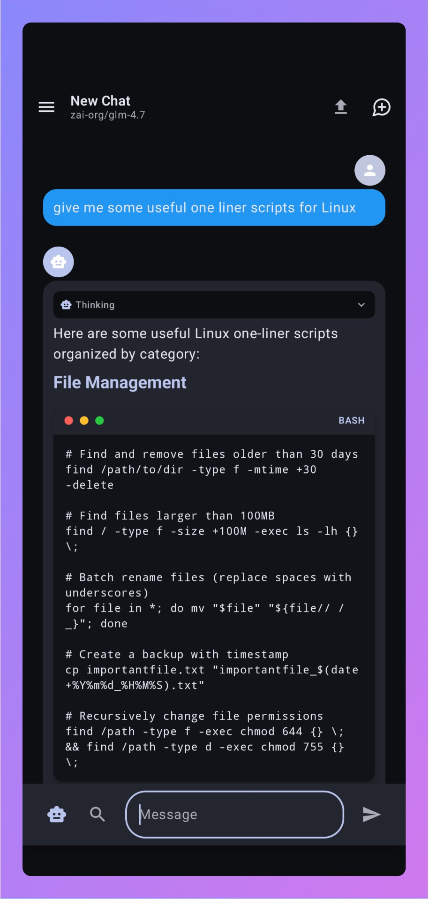

# NanoChat for Android

<div align="center">



**Native Android companion app for [nanochat](https://github.com/nanogpt-community/nanochat)**

A modern, full-featured Android client for the self-hostable nanochat AI chat platform.

[](LICENSE)
</div>

## Features

### Core Chat Functionality
- **Real-time streaming responses** with Server-Sent Events (SSE)
- **Markdown rendering** with support for code blocks, tables, and formatting
- **Message history** with persistent local storage (Room database)
- **Search conversations** quickly with integrated search
- **Pin important conversations** for easy access
- **Delete conversations** with swipe or button

### AI Model Integration
- **Multiple model support** with easy model selector
- **Web search integration** with multiple providers (Linkup, Tavily, Exa, Kagi)
- **Vision support** for image inputs
- **Model benchmarks** display token usage and costs

### Assistants & Projects
- **Custom assistants** creation and management
- **Project organization** for grouping conversations
- **Assistant instructions** and configuration
- **Model selection** per assistant/project

### Settings & Customization
- **Account settings** with privacy controls
- **Privacy mode** to hide personal information
- **Context memory** for compressing long conversations
- **Persistent memory** for cross-conversation facts
- **Content processing** options (YouTube transcripts, web scraping, follow-up questions)
- **Model preferences** for chat titles and follow-up questions
- **TTS/STT settings** for voice input and output

### User Interface
- **Material 3 design** with modern aesthetics
- **Navigation drawer** with conversation list and quick actions
- **Circular avatars** for visual conversation identification
- **Rounded search input** with real-time filtering
- **Icon-based navigation** for Assistants, Projects, and Settings
- **Dark/Light theme** support
- **Proper back button** handling throughout the app

### Technical Features
- **Offline access** to cached conversations
- **Secure storage** with EncryptedSharedPreferences
- **Better Auth integration** for session management
- **API key management** through self-hosted backend
- **HTTP streaming** with OkHttp
- **Dependency injection** with Hilt
- **MVVM architecture** with clean separation of concerns

## Screenshots

The app features a clean, modern Material 3 interface:
- Rounded cards with surface colors
- Circular avatars with primary container backgrounds
- Compact spacing for efficient use of screen space
- Icon-only bottom navigation for Assistants, Projects, and Settings
- Full-width "New Chat" button with rounded corners

## Backend Integration

This Android app is designed to work with your **self-hosted nanochat backend**.

To get started:
1. Deploy the [nanochat backend](https://github.com/nanogpt-community/nanochat) to your server
2. Provide your NanoGPT API keys in the backend configuration
3. Connect the Android app by entering your backend URL during setup
4. Sign in with your credentials or use passkey authentication

**Important:** This app does not store API keys locally. All API keys are managed server-side by your nanochat backend instance.

## Architecture

The app follows modern Android architecture patterns:

```
┌─────────────────────────────────────┐
│         UI Layer (Compose)          │
│  - Screens (Chat, Settings, etc.)   │
│  - ViewModels (State Management)    │
│  - Navigation Component             │
├─────────────────────────────────────┤
│         Domain Layer                │
│  - Use Cases                        │
│  - Repository Interfaces            │
├─────────────────────────────────────┤
│          Data Layer                 │
│  - Repository Implementations       │
│  - Local Cache (Room Database)      │
│  - API Services (Retrofit)          │
└─────────────────────────────────────┘
```

## Technology Stack

- **UI:** Jetpack Compose BOM 2024.06+
- **Navigation:** Navigation Compose 2.7+
- **DI:** Hilt 2.51
- **Networking:** Retrofit 2.11 + OkHttp 4.12
- **Streaming:** OkHttp SSE
- **Database:** Room 2.6+
- **Serialization:** Kotlinx Serialization 1.7+
- **Coroutines:** Kotlinx Coroutines 1.8+
- **Image Loading:** Coil 2.7+
- **Markdown:** Compose Markdown Renderer
- **Auth:** Better Auth integration
- **Min SDK:** 26 (Android 8.0)
- **Target SDK:** 35 (Android 15)

## Installation

### From Source

```bash
# Clone the repository
git clone https://github.com/jcrabapple/nanochat-android.git
cd nanochat-android

# Build the app
./gradlew assembleDebug

# Install on connected device
adb install app/build/outputs/apk/debug/app-debug.apk
```

### Requirements

- Android Studio 2024.1.1 or later
- JDK 17 or later
- Android SDK 35

## Configuration

On first launch, you'll need to:

1. **Enter your backend URL** - The URL where your nanochat backend is hosted
2. **Sign in** - Use email/password or passkey authentication
3. **Start chatting!** - Create new conversations or load existing ones

## Contributing

Contributions are welcome! Please feel free to submit a Pull Request.

1. Fork the repository
2. Create your feature branch (`git checkout -b feature/AmazingFeature`)
3. Commit your changes (`git commit -m 'Add some AmazingFeature'`)
4. Push to the branch (`git push origin feature/AmazingFeature`)
5. Open a Pull Request

## License

This project is licensed under the MIT License - see the [LICENSE](LICENSE) file for details.

## Acknowledgments

- [nanochat](https://github.com/nanogpt-community/nanochat) - The self-hostable backend this app connects to
- [NanoGPT](https://nano-gpt.com) - AI platform powering the chat
- [Jetpack Compose](https://developer.android.com/jetpack/compose) - Modern Android UI toolkit
- [Material 3](https://m3.material.io/) - Design system used throughout the app

---

**Built with ❤️ using Jetpack Compose and Material 3**

*Note: This is a companion app. You need to run your own instance of the [nanochat backend](https://github.com/nanogpt-community/nanochat) to use this application.*
